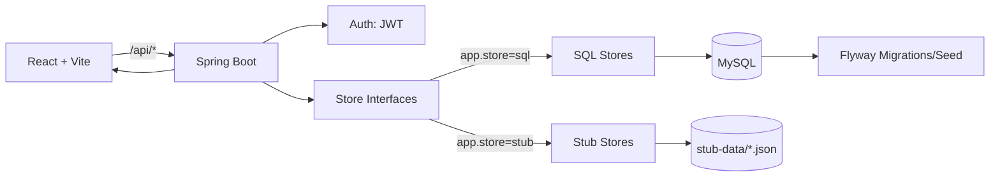

# YU Path Builder

YU Path Builder is a full-stack web application that helps York University students explore courses, view course details, build a conflict-free weekly schedule, and check program requirements.

This project was developed using a React + Vite frontend and a Spring Boot backend. For Iteration 2, the backend supports two persistence modes:
- SQL mode using MySQL + Flyway
- STUB mode using JSON stub data

## Features

- User registration and login
- Course search
- Course details ("More Info")
- Program checklist
- Support for both SQL and STUB data sources

## Tech Stack

### Frontend
- React
- Vite

### Backend
- Spring Boot
- Spring Data JPA
- JWT authentication
- Flyway

### Persistence
- MySQL (SQL mode)
- JSON stub data (STUB mode)

## Architecture Overview

The system follows a client/server architecture:

- Frontend (React + Vite): provides the UI for login/register, course search, course details, schedule building, and checklist viewing
- Backend (Spring Boot): exposes REST APIs for authentication, catalog access, course search/details, schedule generation, and checklist retrieval
- Persistence layer supports two modes:
  - SQL mode with MySQL + Flyway migrations
  - STUB mode with JSON stub data

A single configuration switch selects the store implementation:
- `app.store=sql` (default)
- `app.store=stub`

The backend uses dependency injection to switch between implementations of:
- `CatalogStore`
- `CourseStore`
- `CourseDetailsStore`
- `ScheduleStore`

### Schedule Build Flow

1. The user selects course codes in the frontend
2. The frontend sends `POST /api/schedule/build`
3. The backend resolves the correct store implementation
4. A conflict-free schedule is generated and returned
5. The frontend renders the weekly schedule grid

### Architecture Diagram



## Repository Structure

```text
project-group-3/
├── frontend/                # React + Vite UI
│   ├── src/
│   │   ├── components/
│   │   │   ├── auth/
│   │   │   └── dashboard/
│   │   ├── pages/
│   │   └── api/
│   └── vite.config.js
│
├── backend/                 # Spring Boot API
│   └── src/main/
│       ├── java/com/yupathbuilder/backend/
│       │   ├── controller/
│       │   ├── service/
│       │   ├── repo/
│       │   ├── store/
│       │   └── store/stub/
│       └── resources/
│           ├── db/migration/
│           ├── stub-data/
│           ├── application.properties
│           └── application-stub.properties
│
└── database/                # DB setup instructions
    ├── docker-compose.yml
    ├── README-TA.md
    └── README-TEAM.md
```

## Prerequisites

Before running the project, make sure you have:
- Node.js
- Java 25
- Docker Desktop or Docker Engine

Database setup instructions are available in:
- `database/README-TA.md`
- `database/README-TEAM.md`

## Running the Project

### Option 1: SQL mode (MySQL + Flyway)

#### 1. Start the database
From the repo root:

```bash
docker compose -f database/docker-compose.yml up -d
```

#### 2. Verify the container is running
```bash
docker ps
```

#### 3. Run the backend
##### Windows
```bat
cd backend
.\mvnw.cmd clean package
.\mvnw.cmd spring-boot:run
```

##### macOS/Linux
```bash
cd backend
./mvnw clean package
./mvnw spring-boot:run
```

Flyway runs automatically when the backend starts.

#### 4. Run the frontend
Open another terminal:

```bat
cd frontend
npm install
npm run dev
```

If PowerShell blocks npm, use:

```bat
npm.cmd run dev
```

Then open the Vite URL, usually:

```text
http://localhost:5173/
```

### Option 2: STUB mode (no database required)

#### Run the backend in STUB mode
##### Windows
```bat
cd backend
.\mvnw.cmd clean package
.\mvnw.cmd spring-boot:run -Dspring-boot.run.profiles=stub
```

##### macOS/Linux
```bash
cd backend
./mvnw clean package
./mvnw spring-boot:run "-Dspring-boot.run.profiles=stub"
```

#### Run the frontend
Open another terminal:

```bat
cd frontend
npm install
npm run dev
```

### Database connection details
- Host: `localhost`
- Port: `3306`
- Database: `yupathbuilder`
- Username: `yupath`
- Password: `yupathpass`

### Stop the database
From the repo root:

```bash
docker compose -f database/docker-compose.yml down
```

### Reset the database completely

```bash
docker compose -f database/docker-compose.yml down -v
docker compose -f database/docker-compose.yml up -d
```

## Main API Endpoints

### Auth
- `POST /api/auth/login`
- `POST /api/auth/register`

#### Login request body
```json
{
  "username": "student@yorku.ca",
  "password": "yourPassword"
}
```

#### Register request body
```json
{
  "firstName": "John",
  "lastName": "Doe",
  "email": "john@yorku.ca",
  "programId": 1,
  "password": "yourPassword",
  "confirmPassword": "yourPassword"
}
```

### Catalog
- `GET /api/faculties`
- `GET /api/programs?facultyId=<id>`

### Checklist
- `GET /api/me/checklist`

### Courses
- `GET /api/courses?q=<query>&season=<FALL|WINTER>&year=<YYYY>`
- `GET /api/courses/{courseCode}/details?season=<...>&year=<...>`

### Schedule
- `POST /api/schedule/build`

#### Example request body
```json
{
  "term": "FALL 2026",
  "courseCodes": ["EECS 2311", "MATH 1013"]
}
```

### Protected Routes
Protected endpoints require:
```text
Authorization: Bearer <JWT>
```

## Design Decisions

Some important design choices in this project include:
- React + Vite for a fast and modular frontend
- Spring Boot for structured backend development and testing
- Dependency Injection to support both SQL and STUB persistence modes
- Backtracking for schedule generation, since it handles section selection and conflict pruning naturally

## Common Issues

### Vite proxy ECONNREFUSED
If the frontend shows proxy errors for `/api/...`, the backend is not running or the port does not match the Vite proxy configuration.

Check:
- backend is running first
- backend port matches `vite.config.js`

### Backend resources changed
If you update backend resource files, restart the backend.

### Flyway checksum mismatch
If Flyway reports migration checksum mismatch, your local database was created with an older version of the migration files. In local development, recreating the database is usually the cleanest fix.

### PowerShell blocks npm
If PowerShell gives a script policy error, run:
```bat
npm.cmd run dev
```

## Notes

- SQL mode is the default mode
- STUB mode is useful for demos and testing without MySQL
- The repository includes a top-level `database/` folder to simplify setup for teammates and TAs

## Additional Documentation

For more detailed documentation, see:
- `database/README-TA.md`
- `database/README-TEAM.md`
- `docs/LOG.md` or `wiki/log.md` if you keep the project log separately

## Team

- Jostin Martinez Castillo
- Fejuku Oyinkansola Barbara
- Wamiq Lakha
- Jaicks Reuben
