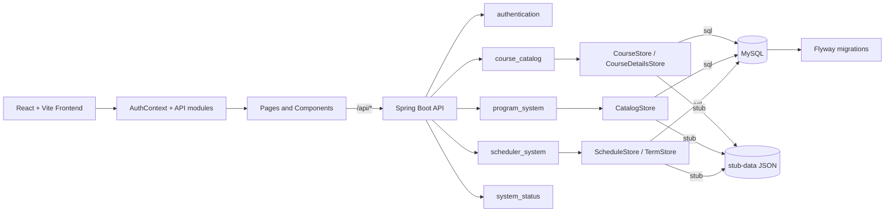

# Architecture - Final Iteration 3 State

This document describes the final architecture visible in the repository at the end of Iteration 3. It updates the earlier ITR2 explanation to match the final module layout, the authenticated user workflow, the SQL/stub seams, and the integration-test boundaries.

## 1. High-Level System View

YU Path Builder is a client/server application:

- Frontend: React + Vite
- Backend: Spring Boot REST API
- Persistence: MySQL + Flyway in SQL mode, JSON-backed stub data in stub mode

The frontend owns the browser experience and calls the backend through authenticated `/api/*` requests. The backend owns the domain logic for authentication, catalog browsing, program data, saved course selections, and schedule construction.

## 2. Final Backend Module Structure

The most important Iteration 3 architecture change is the move to feature-based packaging.

Final package layout:

```text
com.yupathbuilder.backend
|-- authentication
|-- config
|-- course_catalog
|-- global_exception_handler
|-- program_system
|-- scheduler_system
|-- system_status
`-- util
```

This replaces the earlier flatter organization that grouped many classes by technical role under shared root folders such as `controller`, `service`, `repo`, and `store`.

## 3. Frontend Structure

The frontend follows a small but clear application-shell structure:

- `App.jsx` selects the active page
- `AuthContext.jsx` owns token and profile state
- `pages/` contains the main screens
- `components/` contains UI building blocks
- `api/` contains backend request wrappers
- `utils/scheduleConflicts.js` derives schedule conflict information for display

Important Iteration 3 UI additions include:

- profile page and account navigation
- saved selected-course synchronization
- schedule conflict display enhancements

## 4. Runtime Modes

The backend is designed to support two store modes:

- `app.store=sql`
- `app.store=stub`

The current store seams are feature-scoped:

- `program_system.store.CatalogStore`
- `course_catalog.store.CourseStore`
- `course_catalog.store.CourseDetailsStore`
- `scheduler_system.store.ScheduleStore`
- `scheduler_system.store.TermStore`

Each seam has SQL and/or stub implementations selected by Spring configuration.

## 5. Main Request Flows

### Authentication And Profile

1. The frontend sends registration or login data to `/api/authentication/*`.
2. The backend validates the request, authenticates against persisted users, and returns a JWT.
3. The frontend stores the token and eagerly loads `/api/authentication/profile`.
4. The profile page reuses the same authenticated session for profile edits and password changes.

### Course Search And Details

1. The dashboard sends term-scoped search requests.
2. The backend reads course and section data through `CourseStore` and `CourseDetailsStore`.
3. The frontend expands a course and lazily fetches section details for the current term.

### Saved Courses And Schedule Build

1. The user adds or removes courses in the dashboard.
2. The frontend calls `/api/me/selected-courses`.
3. The backend persists selections by authenticated user and term.
4. The frontend calls `/api/schedule/build` for the active term.
5. The backend returns chosen sections.
6. The frontend renders a time-grid schedule and highlights conflicts.

### Program Checklist

1. The frontend requests `/api/me/checklist`.
2. The backend resolves the authenticated user's program.
3. The checklist is built from program requirements and returned as grouped DTOs.

## 6. Revised Text Diagram

The non-text diagram assets in the repository are:

- `docs/Architecture Sketch.png`
- `wiki_and_architecture_ITR1/assets/architecture_sketch.png`

Those assets predate some final Iteration 3 refinements. A revised diagram for the final system should show:

- React frontend shell
- Auth context and page-level flows
- Spring Boot backend
- feature-based backend modules
- SQL/stub store seams
- MySQL + Flyway path
- stub-data JSON path
- integration-test seams at the SQL store boundaries

The following Mermaid sketch captures that final architecture in text form:



## 7. Integration-Test Seams

The backend integration tests intentionally exercise the SQL-backed store seams. These are the clearest repository-confirmed seams for integration testing:

| Seam | Production classes involved | Integration test class |
|---|---|---|
| Program and checklist catalog seam | `program_system.store.CatalogStore`, `program_system.store.SqlCatalogStore` | `SqlCatalogStoreIT` |
| Course search seam | `course_catalog.store.CourseStore`, `course_catalog.store.SqlCourseStore` | `SqlCourseStoreIT` |
| Course details seam | `course_catalog.store.CourseDetailsStore`, `course_catalog.store.SqlCourseDetailsStore` | `SqlCourseDetailsStoreIT` |
| Schedule build seam | `scheduler_system.store.ScheduleStore`, `scheduler_system.store.SqlScheduleStore` | `SqlScheduleStoreIT` |

These tests live under:

- `backend/src/test/java/com/yupathbuilder/backend/integration/store/`

## 8. Architectural Deviations And Open Issues

The final architecture is clearer than the ITR2 version, but several issues remain visible:

1. Stub mode is not cleanly runnable because `application-stub.properties` still contains merge markers.
2. The SQL Docker host port and default backend datasource port are inconsistent.
3. The backend exposes `/api/terms`, but the frontend still hard-codes the available terms.
4. Checklist completion state exists only in the browser and is not persisted.

## 9. Related Documents

- [`Repo-Structure.md`](Repo-Structure.md)
- [`Refactoring.md`](Refactoring.md)
- [`API-Endpoints.md`](API-Endpoints.md)
- [`log.md`](log.md)
