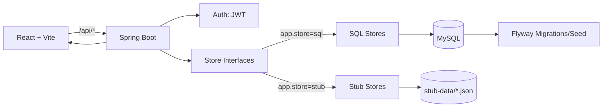

# Architecture (ITR2)

## High-level overview
The system is a client/server web app:

- **Frontend (React + Vite)**: UI for register/login, course search, viewing course details, selecting courses, building a schedule, and viewing a program checklist.
- **Backend (Spring Boot)**: REST API for auth + course search/details + schedule generation + checklist.
- **Persistence** (ITR2 requirement):
  - **SQL mode**: MySQL database with **Flyway** migrations + seed data.
  - **STUB mode**: JSON stub data under `backend/src/main/resources/stub-data/`.

A single configuration switch selects the mode:
- `app.store=sql` (default)
- `app.store=stub`

## Key design: Dependency Injection (SQL vs STUB)
To support both data sources with minimal code changes, the backend uses interfaces ("stores") with two implementations:

- `CatalogStore` → faculties/programs/checklist
- `CourseStore` → course list/search
- `CourseDetailsStore` → course details/sections ("More Info")
- `ScheduleStore` → build schedule

Spring selects the implementation using `@ConditionalOnProperty(name="app.store", havingValue="...")`.

## Data flow (build schedule)
1. User selects course codes in the UI
2. UI calls `POST /api/schedule/build` with `{ term, courseCodes }`
3. Backend uses `ScheduleStore`:
   - SQL mode: `ScheduleService` + DB data
   - STUB mode: deterministic stub rules (no DB)
4. Backend returns chosen sections; UI renders them in the weekly grid

## Sketch (Mermaid)

## Files worth knowing
- **SQL migrations**: `backend/src/main/resources/db/migration/`
- **Stub data**: `backend/src/main/resources/stub-data/`
- **Mode selection**:
  - SQL: `application.properties`
  - STUB: `application-stub.properties` + run with profile `stub`
